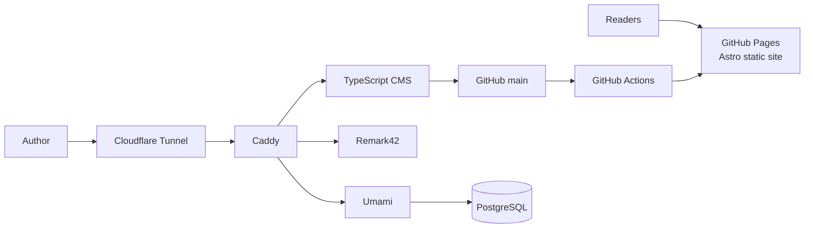

# Web World Wide

[](https://github.com/WebWorldWide/webworldwide-website/actions/workflows/quality.yml)
[](https://github.com/WebWorldWide/webworldwide-website/actions/workflows/e2e.yml)
[](https://github.com/WebWorldWide/webworldwide-website/actions/workflows/lighthouse.yml)
[](https://github.com/WebWorldWide/webworldwide-website/actions/workflows/deploy.yml)

Web World Wide is Adam Nolle's fast, self-hosted publishing stack. Markdown is
the source of truth, Astro produces the public site, and a custom TypeScript CMS
handles writing, media, comments, analytics, scheduling, and syndication.

**Live site:** [webworldwide.online](https://webworldwide.online)

## Production architecture



The production backend runs on the Ubuntu server named **Adlon**:

| Component                                             | Production location | Purpose                                                    |
| ----------------------------------------------------- | ------------------- | ---------------------------------------------------------- |
| Public site                                           | GitHub Pages        | Global static hosting for the Astro build                  |
| CMS, Caddy, Remark42, Umami, PostgreSQL, LanguageTool | Docker on Adlon     | Authoring and stateful services                            |
| Public ingress                                        | Cloudflare Tunnel   | HTTPS without inbound router ports                         |
| Application checkout and Docker data                  | Samsung NVMe SSD    | Low-latency builds, databases, and containers              |
| Backup archives and shared media                      | 2 TB data disk      | Capacity-oriented storage outside the hot application path |

Production endpoints:

- Site: <https://webworldwide.online>
- Admin: <https://admin.webworldwide.online>
- Comments: <https://comments.webworldwide.online>
- Analytics: <https://analytics.webworldwide.online>

`main` is the only persistent branch. A push to `main` builds and deploys the
public Astro site through GitHub Actions. The Adlon checkout follows the same
branch and rebuilds the Docker stack when backend code changes.

## Stack

- **Astro 7 + React 19** — static pages and small interactive islands
- **TypeScript** — site scripts, CMS backend, browser source, tests, and tooling
- **Express 5 + SQLite** — CMS API, authentication, media metadata, and activity
- **TipTap + CodeMirror** — block and Markdown editing
- **Remark42** — privacy-friendly comments
- **Umami + PostgreSQL** — privacy-friendly analytics
- **LanguageTool** — private spell and grammar checks
- **Caddy + Cloudflare Tunnel** — internal routing and public ingress
- **GitHub Actions + Pages** — tested static deployment

Browser JavaScript is generated from TypeScript during the build. Generated
bundles are intentionally ignored; the repository does not track JavaScript
source or build output.

## Local development

Requirements:

- Node.js 22 or newer
- npm
- Docker Engine, Docker Desktop, OrbStack, or Colima

```bash
git clone https://github.com/WebWorldWide/webworldwide-website.git
cd webworldwide-website
npm install
npm run dev
```

Open:

- Public site: <http://localhost:4321>
- Admin: <http://localhost:3000>
- Comments: <http://localhost:8081>
- Analytics: <http://localhost:3001>

The development admin account is `admin` / `password`. Those credentials are
created only by the local seed command and must never be used in production.

Useful commands:

| Command               | Purpose                                                           |
| --------------------- | ----------------------------------------------------------------- |
| `npm run dev`         | Run the Astro site and CMS                                        |
| `npm run dev:full`    | Run the complete local stack, including Docker services           |
| `npm run dev:check`   | Verify every local service                                        |
| `npm run build:check` | Type-check, build, and validate generated HTML                    |
| `npm run lint`        | Run TypeScript, CSS, Markdown, formatting, HTML, and site linting |
| `npm test`            | Run the site and CMS test suites                                  |
| `npm run test:unit`   | Run browser and development-tool unit tests                       |
| `npm run test:e2e`    | Run Playwright end-to-end and accessibility coverage              |
| `npm run db:seed`     | Seed the local development database                               |
| `npm run db:reset`    | Recreate local development data after confirmation                |

See [CONTRIBUTING.md](CONTRIBUTING.md) for editor internals, testing patterns,
accessibility requirements, and extension points.

## Repository layout

```text
admin/       TypeScript CMS server, browser source, migrations, and tests
docker/      Production and development Compose definitions plus Caddy routing
migrate/     One-time Ghost/content migration utilities
scripts/     Deployment, backup, maintenance, health, and local-dev tooling
site/        Astro site, Markdown content, styles, assets, and tests
test/        Playwright end-to-end and accessibility tests
```

Generated directories such as `site/dist`, `site/.astro`, `admin/dist`, and
`admin/public/js` are disposable build output and are not committed.

## Production deployment

Create `docker/.env` from `docker/.env.example`, keep it mode `0600`, and never
commit it. From the production checkout:

```bash
git pull --ff-only origin main
docker compose --project-directory docker up -d --build --remove-orphans
docker compose --project-directory docker ps
```

The Cloudflare tunnel routes all backend hostnames to Caddy over the private
Compose network. Caddy's host port is bound to loopback only; production traffic
does not require a public inbound port on Adlon.

Confirm a deployment with:

```bash
curl -fsS https://admin.webworldwide.online/auth/status
curl -fsS https://comments.webworldwide.online/ping
curl -fsS -o /dev/null https://analytics.webworldwide.online/
curl -fsS -o /dev/null https://webworldwide.online/
```

## Backups and maintenance

The operational scripts support both the historical `/opt` layout and a custom
production checkout through environment variables:

```bash
export WWWIDE_APP_DIR=/path/to/webworldwide-website
export WWWIDE_BACKUP_DIR=/path/to/www-blog-backups
export WWWIDE_STATE_DIR=/path/to/runtime-state
```

- `scripts/backup.sh` snapshots PostgreSQL, Remark42, the CMS SQLite database
  and WAL, and an age-encrypted copy of `docker/.env`.
- `scripts/auto-update.sh` performs fast-forward-only updates and rebuilds only
  after a successful pull.
- `scripts/watchdog.sh` checks and rate-limits recovery of unhealthy services.
- `scripts/promote-scheduled.sh` publishes posts whose scheduled time arrived.
- `scripts/dump-webmentions.sh` publishes approved webmention snapshots.
- Daily, monthly, and yearly maintenance scripts checkpoint databases, verify
  integrity, and report dependency risk.

Backups are useful only after a restore test. `scripts/restore.sh` is the
documented recovery path; keep the age private key outside the server.

## Security posture

- Secrets live only in the ignored, permission-restricted production env file.
- CMS containers run as the unprivileged host user.
- The CMS sees Docker through a read-only, GET-only socket proxy.
- Stateful services are reachable only through Caddy's private Compose network.
- WebAuthn passkeys protect the production admin account.
- Uploaded files, outbound embeds, and server-side fetches are validated before
  processing.
- CI enforces type checks, unit tests, accessibility checks, end-to-end tests,
  and Lighthouse budgets.

## License and acknowledgements

This project builds on Astro, React, TipTap, ProseMirror, CodeMirror, KaTeX,
Express, better-sqlite3, Remark42, Umami, PostgreSQL, Caddy, Cloudflare Tunnel,
the AT Protocol SDK, Playwright, axe-core, Vitest, and Lighthouse.
